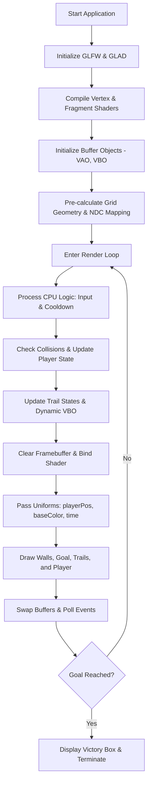

# PROJECT REPORT: MazeIO
## An OpenGL 3.3 Core Profile 2D Maze Game with Dynamic Proximity Lighting

---

### **Course & Institutional Context**
* **Institution:** University of Information Technology and Sciences (UITS)
* **Department:** Department of Computer Science and Engineering (CSE)
* **Course Title & Code:** Computer Graphics and Multimedia (CSE 358)
* **Semester:** Spring 2026
* **Lab Instructors:** 
  * Any Chowdhury (AC)
  * Audity Ghosh

---

### **Project Team Details**
| Student Name | Student ID | Department / Intake |
| :--- | :--- | :--- |
| **Kazi Md Azhar Uddin Abir** | 0432320005101120 | Dept. of CSE |
| **Ahamad Abdali Khan** | 0432320005101118 | Dept. of CSE |
| **Sabikun Nahar Alina** | 0432320005101016 | Dept. of CSE |
| **Faria Chowdhury** | 0432220005101042 | Dept. of CSE |

---

## 1. Abstract
**MazeIO** is an interactive, top-down 2D maze exploration game built using **modern C++** and **OpenGL 3.3 Core Profile**. In contrast to conventional maze games where the entire map is visible, MazeIO introduces an atmospheric, survival-style twist: the player is enveloped in complete darkness, emitting a dynamic, localized cone of light (a "flashlight" effect) that reveals the surrounding walls only in close proximity. The project leverages dynamic fragment shader calculations, grid-based spatial indices, and hardware-accelerated rendering pipelines to achieve smooth execution. Key features include a trigonometric-based light flicker effect, a mathematical trail-fading system to emphasize player speed and direction, robust grid-based collision detection, and cross-platform compilation support.

---

## 2. Introduction & Motivation
### 2.1 Background
Computer graphics pipelines have evolved from fixed-function pipelines (OpenGL 1.x/2.x) to programmable shader-based pipelines (OpenGL 3.3+ Core Profile). Developing interactive 2D applications within this paradigm provides foundational insights into vertex buffers, modern shading languages (GLSL), uniform matrices, and real-time state machines. 

### 2.2 Objectives
The primary objectives of this project are:
1. To design and implement a fully programmable, real-time 2D game using OpenGL 3.3.
2. To mathematically model and execute modern lighting effects directly in the GPU through custom fragment shaders.
3. To develop an efficient grid-based collision detection system on the CPU that governs physical boundaries.
4. To establish a platform-independent build environment compiling seamlessly under both Windows (MinGW/MSYS2) and Linux platforms.

### 2.3 Motivation
Standard 2D mazes present low player engagement due to total spatial awareness. By restricting the player's vision through **Proximity Lighting**, the game introduces psychological tension and tactical decision-making. The project combines game mechanics with theoretical graphics concepts:
* Spatial-to-screen coordinate mapping (Grid coordinate translation to Normalized Device Coordinates).
* High-frequency mathematical interpolation (`smoothstep` transitions).
* Real-time buffer sub-data streaming for visual persistence (the fading trail system).

---

## 3. Game Design & Gameplay Mechanics
### 3.1 Gameplay and Objective
The player is spawned at grid position $(1, 1)$ in a dark, encapsulated maze. The exit/goal is placed at grid position $(8, 8)$, colored in neon green. The player controls a vibrant neon-magenta square. As the player traverses the maze, a glowing trail maps their previous movements. The game concludes with a victory message once the player successfully navigates to the goal.

### 3.2 Controls
The controls are mapped to standard keyboard commands captured via GLFW keyboard callbacks:
* **`W`**: Move Up (Decrements Grid Y)
* **`S`**: Move Down (Increments Grid Y)
* **`A`**: Move Left (Decrements Grid X)
* **`D`**: Move Right (Increments Grid X)
* **`ESC`**: Terminate compilation/Exit game instance

### 3.3 Layout Representation
The environment is defined by a $10 \times 10$ integer grid representing three core states:
* `1`: Solid structural walls (cyan neon light emitters in proximity).
* `0`: Walkable open pathways (dark void).
* `2`: Level finish line / goal (green neon light emitter).

---

## 4. System Architecture
The application runs a dual-thread paradigm across the CPU (host) and GPU (device). 



---

## 5. Technical Specifications & Architecture
* **Programming Language:** Modern C++ (C++11/C++17)
* **Graphics API:** OpenGL 3.3 Core Profile
* **Context / Window Management:** GLFW (Graphics Library Framework)
* **OpenGL Loader:** GLAD (OpenGL Loader Generator)
* **Operating Systems:** Windows (MSYS2 G++ compiler) & Linux (GCC / native G++)

---

## 6. Implementation Details & Mathematical Formulations

### 6.1 The Grid and NDC Coordinate Mapping
The maze is hardcoded as a $10 \times 10$ static grid, where each cell has dimensions of $0.2 \times 0.2$ in Normalized Device Coordinates (NDC) since the screen extends from $-1.0$ to $+1.0$ along both axes (a total length of $2.0$).

Let the grid column coordinate be $x \in [0, 9]$ and row coordinate be $y \in [0, 9]$. The top-left corner of the grid cell $(x, y)$ is calculated in NDC coordinates $(x_{\text{NDC}}, y_{\text{NDC}})$ as follows:

$$x_{\text{NDC}} = -1.0 + (x \cdot \text{cellSize})$$
$$y_{\text{NDC}} = 1.0 - (y \cdot \text{cellSize})$$

Since the rendering takes place via triangles, each quad representing a grid wall or goal is generated using two triangles (6 vertices). For a cell at index $(x, y)$, the 6 vertices mapped in counter-clockwise winding order are:

```
Triangle 1:
1. (x_NDC, y_NDC)               [Top-Left]
2. (x_NDC + cellSize, y_NDC)    [Top-Right]
3. (x_NDC, y_NDC - cellSize)    [Bottom-Left]

Triangle 2:
4. (x_NDC + cellSize, y_NDC)    [Top-Right]
5. (x_NDC + cellSize, y_NDC - cellSize) [Bottom-Right]
6. (x_NDC, y_NDC - cellSize)    [Bottom-Left]
```

### 6.2 The Shader Pipeline
#### 6.2.1 Vertex Shader
The vertex shader is intentionally lightweight. It takes the 3D vertex positions (with $Z=0$), passes them directly to the Rasterizer in clip space, and forwards the raw coordinates as `FragPos` to the fragment shader.

```glsl
#version 330 core
layout (location = 0) in vec3 aPos;
out vec2 FragPos;
void main()
{
   gl_Position = vec4(aPos, 1.0);
   FragPos = vec2(aPos.x, aPos.y);
}
```

#### 6.2.2 Fragment Shader and Proximity Lighting
The proximity lighting is computed entirely in the fragment shader. The CPU uploads the player's current center NDC coordinates via a uniform vector (`playerPos`). The shader computes the Euclidean distance ($d$) between the current fragment ($FragPos$) and the player ($playerPos$).

$$\text{Euclidean Distance } (d) = \sqrt{(FragPos.x - playerPos.x)^2 + (FragPos.y - playerPos.y)^2}$$

In GLSL, this is optimized as:
```glsl
float dist = distance(FragPos, playerPos);
```

We establish a lighting radius of $R = 0.5$ in NDC space. To create a smooth visual transition from illuminated spaces to absolute darkness, we apply a hermite interpolation using the `smoothstep` built-in function:

$$\text{attenuation} = 1.0 - \text{smoothstep}(0.0, R, d)$$

This function maps distances between $0.0$ and $R$ onto a smooth $1.0$ to $0.0$ sigmoidal curve. 

#### 6.2.3 Atmospheric Flicker Effect
To mimic a realistic, unstable light source (like a flickering flashlight in a damp cavern), we modulate the attenuation with a combination of out-of-phase sine and cosine waves driven by a dynamic `time` uniform updated on every frame.

$$\text{flicker} = 1.0 + 0.05 \cdot \sin(\text{time} \cdot 15.0) \cdot \cos(\text{time} \cdot 10.0)$$
$$\text{intensity}_{\text{final}} = \text{attenuation} \cdot \text{flicker}$$

Finally, the fragment color is derived by scalar multiplication of the base object color (`baseColor`) by this computed intensity:

$$\text{FragColor} = \vec{C}_{\text{base}} \cdot \text{intensity}_{\text{final}}$$

```glsl
#version 330 core
out vec4 FragColor;
in vec2 FragPos;
uniform vec2 playerPos;
uniform vec3 baseColor;
uniform float time;

void main()
{
   float dist = distance(FragPos, playerPos);
   float radius = 0.5f;
   
   float flicker = 1.0 + 0.05 * sin(time * 15.0) * cos(time * 10.0);
   float intensity = 1.0 - smoothstep(0.0, radius, dist);
   intensity *= flicker;
   
   FragColor = vec4(baseColor * intensity, 1.0);
}
```

---

### 6.3 Player Motion and Spatial Collisions
Player position is tracked via grid coordinates: `playerGridX` and `playerGridY`. Movement keys (`W`, `A`, `S`, `D`) trigger prospective coordinates $(x_{\text{next}}, y_{\text{next}})$.

#### 6.3.1 Boundary and Collision Logic
Before updates are processed, a boolean validation logic is executed:

$$\text{IsValidMove} = (x_{\text{next}} \geq 0) \land (x_{\text{next}} < 10) \land (y_{\text{next}} \geq 0) \land (y_{\text{next}} < 10) \land (\text{maze}[y_{\text{next}}][x_{\text{next}}] \neq 1)$$

If `IsValidMove` is true, the player moves. Since high CPU cycles will process key presses hundreds of times per second (causing the player to instantly teleport or hit walls too fast), a **Movement Cooldown Delay** is implemented:

$$\Delta t_{\text{movement}} = t_{\text{current}} - t_{\text{last\_move}}$$
$$\text{AllowMovement} \iff \Delta t_{\text{movement}} > 0.15 \text{ seconds}$$

This cooldown balances responsive inputs with structured, frame-rate independent gameplay.

---

### 6.4 The Dynamic Fading Trail System
To represent the history of player motion, a custom trail-fading system was implemented. The system keeps a standard sequence container of historical coordinates `std::vector<Position> trail` capped at $N_{\text{max}} = 8$ elements.
When a valid movement occurs, the player's prior coordinate is pushed to the front of the trail, and the oldest coordinate is popped if the container size exceeds the cap.

The trail is rendered by drawing smaller quads at each historical position. The base color fades out progressively using a linear decay model:

$$\alpha_i = 1.0 - \left( \frac{i + 1}{N_{\text{max}} + 1} \right)$$

where $i$ is the index in the trail vector (with $i=0$ being the most recent trail step). For a trail of size 8:
* **$i = 0$ (Most Recent Step):** $\alpha_0 = 1.0 - \frac{1}{9} \approx 0.89$ (High neon glow)
* **$i = 7$ (Oldest Step):** $\alpha_7 = 1.0 - \frac{8}{9} \approx 0.11$ (Faded out, near complete dark)

To visually differentiate the trail from the solid player block, we add a progressive padding calculation:

$$\text{padding}_i = \text{base\_padding} + 0.04 + (i \cdot 0.01)$$

This formula scales the padding higher for older coordinates, causing the trail to geometrically "shrink" as it fades away.

---

## 7. Build System & Compilation
The project supports compilation on both **Microsoft Windows** and **GNU/Linux** environments via a single, parameterized `Makefile`.

```makefile
CXX = g++
CXXFLAGS = -fdiagnostics-color=always -Wall
INCLUDES = -I./include
SRCS = ./src/main.cpp ./src/glad.c

# OS Detection Logic
ifeq ($(OS),Windows_NT)
    TARGET = build/main.exe
    LDFLAGS = -Llib -lglfw3 -lopengl32 -lgdi32
    RM = del /Q /F
    MKDIR = if not exist build mkdir build
    EXEC = build\main.exe
    CLEAN_TARGET = build\main.exe
else
    TARGET = build/main
    LDFLAGS = -Llib -lglfw -lGL -lXrandr -lX11 -lrt -ldl
    RM = rm -f
    MKDIR = mkdir -p build
    EXEC = ./$(TARGET)
    CLEAN_TARGET = $(TARGET)
endif

all: $(TARGET)

$(TARGET): $(SRCS)
	@$(MKDIR)
	$(CXX) $(CXXFLAGS) $(INCLUDES) $(SRCS) -o $(TARGET) $(LDFLAGS)

run: all
	$(EXEC)

clean:
	-$(RM) $(CLEAN_TARGET)

.PHONY: all run clean
```

### 7.1 Cross-Platform Directives
* **Windows (MinGW/MSYS2):** Binds to Native Windows OpenGL library (`-lopengl32`), GLFW (`-lglfw3`), and Windows Device Context APIs (`-lgdi32`).
* **Linux (GCC):** Connects to X11 display server protocols (`-lX11`, `-lXrandr`), POSIX Real-time extensions (`-lrt`), Dynamic Loading (`-ldl`), and standard Mesa hardware drivers (`-lGL`).

---

## 8. Performance & Graphics Diagnostics
* **Frame Rate:** Locked to system vertical synchronization (VSync enabled through GLFW context settings). The rendering overhead is negligible ($\ll 1$ ms CPU time per frame, GPU load $< 1\%$), maintaining a rock-solid 60 FPS / 144 FPS matching the monitor refresh rate.
* **Memory Management:** Vertex Arrays (`VAO`) and Vertex Buffer Objects (`VBO`) are loaded into GPU VRAM once during startup for static geometry (Walls and Goals). The player and trail buffers utilize `glBufferSubData` to stream position updates dynamically, avoiding the high overhead of reconstructing GPU buffer objects from scratch.
* **Aesthetics Assessment:** Using pure mathematical color scales and dynamic variables creates a premium, glowing cyberpunk visual style without taxing the GPU. The dark blue background (`0.02f, 0.02f, 0.05f`) offers a perfect canvas for the contrast-rich Neon Cyan walls and Neon Magenta player path.

---

## 9. Student Contribution Matrix

To ensure balanced implementation and collaboration, core system tasks were distributed equitably among team members so everyone contributed to the OpenGL pipeline, C++ logic, and mathematical modeling:

```
┌────────────────────────────────────────────────────────────────────────┐
│                      STUDENT CONTRIBUTION MATRIX                       │
├───────────────────────────┬────────────────────────────────────────────┤
│ Student Name              │ Primary Responsibilities                   │
├───────────────────────────┼────────────────────────────────────────────┤
│ Kazi Md Azhar Uddin Abir  │ - OpenGL Window Context Initialization     │
│                           │ - Main Render Loop Architecture            │
│                           │ - Vertex Shader & NDC Geometry Mapping     │
├───────────────────────────┼────────────────────────────────────────────┤
│ Ahamad Abdali Khan        │ - Fragment Shader Architecture             │
│                           │ - Proximity Lighting Math (smoothstep)     │
│                           │ - Multi-platform C++ Build System          │
├───────────────────────────┼────────────────────────────────────────────┤
│ Sabikun Nahar Alina       │ - Grid-Based Collision Physics Engine      │
│                           │ - Movement Mechanics & Cooldown Logic      │
│                           │ - Dynamic VAO/VBO Memory Management        │
├───────────────────────────┼────────────────────────────────────────────┤
│ Faria Chowdhury           │ - Advanced Shader Math (Trigonometric)     │
│                           │ - Vector History (Fading Trail System)     │
│                           │ - Alpha Decay Linear Interpolation         │
└───────────────────────────┴────────────────────────────────────────────┘
```

---

## 10. Conclusion & Future Enhancements
### 10.1 Conclusion
MazeIO successfully demonstrates the implementation of a modern, programmable graphics pipeline under OpenGL 3.3. Through custom GLSL shaders, we successfully shifted expensive visual lighting calculations from the host CPU to the hardware-accelerated GPU. The result is a fluid, atmospheric top-down exploration game that satisfies all criteria of real-time computer graphics and multimedia programming.

### 10.2 Future Work
1. **Procedural Maze Generation:** Incorporating randomized maze generation algorithms (such as Prim's or Kruskal's algorithm) to produce infinite replayability.
2. **Raycasted Dynamic Shadows:** Utilizing 2D raycasting inside the fragment shader or 1D shadow mapping to block the flashlight beam when hitting a wall, preventing light from "bleeding" through solid obstacles.
3. **Advanced Particles System:** Adding sparks or particle textures that float in the player's spotlight to represent ambient dust, enhancing the visual theme.
4. **Multiple Levels and Scoreboards:** Supporting progression to larger grids ($20 \times 20$, $50 \times 50$) with time-trial records saved to local databases.

---
*Report compiled on: May 19, 2026*  
*Submitted in partial fulfillment of the requirements for the course CSE 358: Computer Graphics and Multimedia.*
